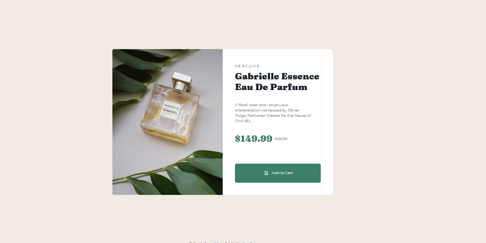

# Frontend Mentor - Product preview card component solution

This is a solution to the [Product preview card component challenge on Frontend Mentor](https://www.frontendmentor.io/challenges/product-preview-card-component-GO7UmttRfa). Frontend Mentor challenges help you improve your coding skills by building realistic projects.

## Table of contents

- [Overview](#overview)
  - [The challenge](#the-challenge)
  - [Screenshot](#screenshot)
  - [Links](#links)
  - [Built with](#built-with)
  - [Useful resources](#useful-resources)
- [Author](#author)

## Overview

product preview card component : responsive solution using plain html and css flex box.

### The challenge

Users should be able to:

- View the optimal layout depending on their device's screen size
- See hover and focus states for interactive elements

### Screenshot

### Links

- Solution URL: https://github.com/Rasc3ta/product_preview_card_component
- Live Site URL: https://rasc3ta.github.io/product_preview_card_component

### Built with

- Semantic HTML5 markup
- CSS custom properties
- Flexbox
- CSS Grid
- Mobile-first workflow

### Useful resources

- [how to make image responsive](https://www.youtube.com/watch?v=7pRZUG1gKfQ) - This helped me with making the images responsive.

## Author

- Frontend Mentor - [@rasc3ta](https://www.frontendmentor.io/profile/rasc3ta)
- Twitter - [@shan5nou](https://www.twitter.com/shan5nou)
